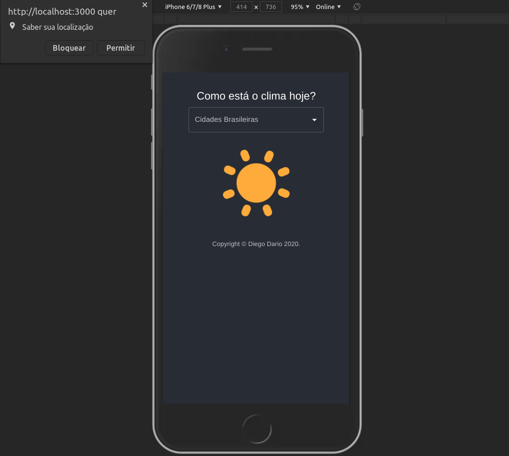

# WeatherApp
Esse é um projeto Javascript FullStack.

<section>
    
</section>

## Dependências
* Docker
* Docker Compose

## Configurando e rodando local
 1. Crie uma network: 
 `docker network create dev-network --subnet 172.24.24.0/24`

 1. Suba os container: 
 `docker-compose up`

### Acesse as Aplicações
UI: `http://localhost:3000`
API: `http://localhost:8080`
BD: `http://localhost:8081`
## Tecnologias
* Node
* MongoDB
* React
